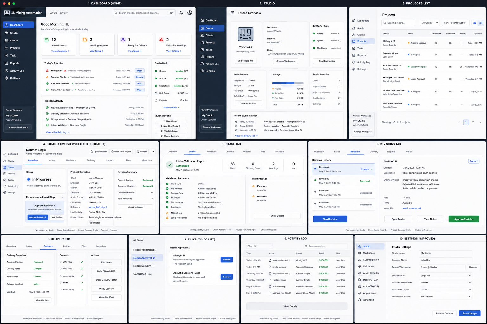

# JL Mixing Studio UI architecture

**Status:** Approved design direction  
**Approved:** July 17, 2026  
**Implementation milestone:** [Issue #8](https://github.com/JLAudio/jl-mixing-studio/issues/8)  
**Functional baseline:** JL Mixing Automation v1.2.0

## Purpose

This document records the approved information architecture and visual direction for JL Mixing Studio. The wireframe is the product-level target, not authorization to implement every displayed value or action immediately.

Implementation remains incremental. Every screen, count, status, and action must be backed by an approved source-of-truth mapping before it becomes functional.

## Approved design direction

The following patterns are approved:

- A persistent dark sidebar paired with a light primary content area.
- JL Mixing Studio branding throughout the application shell.
- Primary navigation for Dashboard, Studio, Clients, Projects, Tasks, Reports, Activity Log, and Settings.
- A visible current-workspace context in the shell.
- Project-centered navigation through Overview, Intake, Revisions, Delivery, Reports, Files, and Metadata.
- Clear page headings, compact summary cards, readable tables, explicit status treatments, and prominent next actions.
- A recommended-next-step pattern that explains the safest valid workflow action.
- Primary, secondary, warning, success, and unavailable action states with consistent meaning.
- Responsive desktop behavior that remains usable at the supported minimum window size.

The wireframe is a layout and interaction reference. Exact copy, sample values, dates, people, versions, spacing, and colors may change during accessible implementation.

## Screen inventory

| Screen | Intended responsibility | Implementation status |
| --- | --- | --- |
| Dashboard | Summarize authoritative workspace and workflow state and expose common next actions | Existing workspace overview will move into the shell |
| Studio | Display studio identity, configured defaults, workspace information, and approved diagnostics | Future milestone |
| Clients | List clients and enter approved client workflows | Guided creation exists; full client screen is future work |
| Projects | Search, filter, and inspect projects using derived lifecycle state | Future milestone |
| Project Overview | Present project identity, lifecycle state, revisions, and recommended next action | Future milestone |
| Intake | Run and present non-destructive validation | Future milestone |
| Revisions | Present revision history and approved revision actions | Future milestone |
| Delivery | Present delivery readiness and approved delivery actions | Future milestone |
| Tasks | Derive actionable work from authoritative project state | Data model decision required |
| Reports | Present generated reports without duplicating their state | Future milestone |
| Activity Log | Present an approved, authoritative history of operations | Data-source decision required |
| Settings | Separate application preferences from approved studio configuration changes | Future milestone |

## Source-of-truth rules

JL Mixing Automation v1.2.0 and the files in the selected JL Mixing workspace remain the functional and data baseline.

| Wireframe concept | Required source or rule |
| --- | --- |
| Client and project counts | Derived from validated workspace discovery |
| Current, approved, and delivered revisions | Derived from supported project manifests |
| Active, awaiting approval, needs delivery, and other workflow labels | Must have an explicitly documented derivation from supported metadata |
| Tasks | Derived view only; no competing application-only task state |
| Recent activity | Requires an approved durable source before implementation |
| Tool health | Restricted Rust diagnostics with fixed executable and argument allowlists |
| Workspace identity | Current approved workspace resolution; arbitrary selection is not implied |
| Settings | Application preferences or supported studio structures, kept distinct |
| Open-folder and DAW actions | Restricted operating-system capabilities with validated paths |
| Search | Requires an approved local indexing or direct-search design |
| Engineer name | Local studio metadata or application preference; not a user account |

Opening or inspecting a workspace must not rewrite project metadata. The interface must not report a successful mutation until the underlying operation and subsequent state verification succeed.

## Wireframe corrections and deferred assumptions

The following sample elements are not approved product behavior as drawn:

- The product name is **JL Mixing Studio**, not JL Mixing Automation. JL Mixing Automation is the compatible external automation system.
- The Studio application version and the JL Mixing Automation compatibility version are separate. The sample `v2.0.0 (Preview)` label is not an approved release version.
- JL Mixing Automation v1.2.0 has no project-completion state. JL Mixing Studio must not invent completed-project counts or completion status.
- Global search, arbitrary workspace switching, user accounts, multi-user activity, system storage diagnostics, editable studio defaults, and unrestricted settings changes require separate approval.
- Activity history requires an authoritative data source; it must not be synthesized in a way that can contradict project files.
- Tasks and dashboard priorities must be derived from supported project state.
- Screen controls must not imply that an unsupported operation is available. Use explicit unavailable or planned states instead.
- Windows must remain usable for supported read-only behavior when JL Mixing Automation v1.2.0 is unavailable.

## Application shell milestone

[Issue #8](https://github.com/JLAudio/jl-mixing-studio/issues/8) is limited to the shared shell and navigation foundation:

1. Build the persistent sidebar and route structure.
2. Move the existing workspace dashboard into the Dashboard route.
3. Preserve guided client creation and all current safety constraints.
4. Establish reusable layout, navigation, card, table, status, and action styles.
5. Provide honest unavailable states for routes that are not implemented.
6. Do not add new workflow state, broad filesystem access, arbitrary command execution, or unsupported mutations.

The shell milestone does not implement the complete ten-screen wireframe.

## Accessibility and responsive requirements

- All navigation and actions must be operable with a keyboard.
- Active navigation must be exposed programmatically and not rely on color alone.
- Focus must remain visible against both the dark sidebar and light content area.
- Status must use text or icons in addition to color.
- Tables must retain meaningful reading order and provide a usable narrow-window treatment.
- Dialog focus, Escape behavior, pending-operation protection, and confirmation semantics from guided client creation must be preserved.
- Content must remain readable at the supported minimum window size without hiding required actions.
- Motion must not be required to understand state changes.
- Text and interactive controls must meet practical contrast and target-size expectations.

## Change control

This document records the approved direction. Material changes to navigation, source-of-truth behavior, lifecycle terminology, or the safety boundary require review before repository implementation. Individual screens and write workflows should be proposed through focused issues and feature-branch pull requests.
