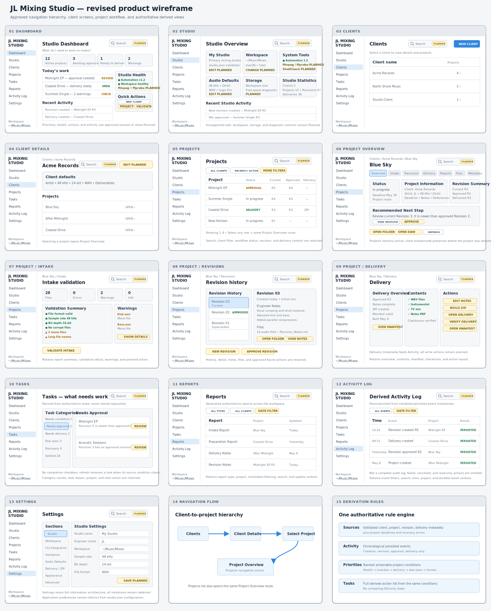

# JL Mixing Studio UI architecture

**Status:** Approved design direction  
**Approved:** July 17, 2026  
**Implemented milestones:** [Issue #8](https://github.com/JLAudio/jl-mixing-studio/issues/8), [Issue #11](https://github.com/JLAudio/jl-mixing-studio/issues/11), [Issue #13](https://github.com/JLAudio/jl-mixing-studio/issues/13), [Issue #15](https://github.com/JLAudio/jl-mixing-studio/issues/15)

**Current milestone:** [Issue #17](https://github.com/JLAudio/jl-mixing-studio/issues/17)

**Functional baseline:** JL Mixing Automation v1.2.0

## Purpose

This document records the approved information architecture and visual direction for JL Mixing Studio. The wireframe is the product-level target, not authorization to implement every displayed value or action immediately.

Implementation remains incremental. Every screen, count, status, and action must be backed by an approved source-of-truth mapping before it becomes functional.

## Approved design direction

The following patterns are approved:

- A persistent white sidebar with a subtle divider, dark text, and a pale-blue active state paired with the light primary content area.
- JL Mixing Studio branding throughout the application shell.
- Primary navigation for Dashboard, Studio, Clients, Projects, Tasks, Reports, Activity Log, and Settings.
- A visible current-workspace context in the shell.
- A consistent global-search location reserved in the shell on every application screen, presented as clearly disabled and planned until search is implemented.
- Contextual search and filtering areas for collection-oriented Clients, Projects, Tasks, Reports, and Activity views.
- Project-centered navigation through Overview, Intake, Revisions, Delivery, Reports, Files, and Metadata.
- Clear page headings, compact summary cards, readable tables, explicit status treatments, and prominent next actions.
- A recommended-next-step pattern that explains the safest valid workflow action.
- Primary, secondary, warning, success, and unavailable action states with consistent meaning.
- Responsive desktop behavior that remains usable at the supported minimum window size.

The wireframe is a layout and interaction reference. Exact copy, sample values, dates, people, versions, spacing, and colors may change during accessible implementation.

## Navigation hierarchy

The primary navigation and nested workflow routes have distinct responsibilities:

1. **Clients** opens the client directory.
2. Selecting a client opens **Client Details**, which presents validated `client.json` fields and that client's projects.
3. Selecting a project from Client Details opens the same **Project Overview** route used by the cross-client Projects directory.
4. Project Overview and the project workflow tabs are project routes. **Projects**, not Clients, remains the active primary navigation item.
5. A breadcrumb may preserve the originating client context without changing the active project route.

Client modification is not implied by the Client Details screen. JL Mixing Automation v1.2.0 has no client-edit command, so editing requires a separately approved safe workflow.

## Screen inventory

| Screen | Intended responsibility | Implementation status |
| --- | --- | --- |
| Dashboard | Answer “What do I need to work on today?” through authoritative summary, Today’s Work, Studio Health, Quick Actions, and Recent Activity sections | Implemented summary and guided New Client; unsupported sections remain Planned |
| Studio | Display studio identity, configured defaults, workspace information, and approved diagnostics | Implemented read-only overview and guided default-workspace setup |
| Clients | List clients and enter approved client workflows | Implemented directory and guided client creation |
| Client Details | Present validated client defaults and the client's projects; enter a selected project | Implemented; guided project creation available; client editing unsupported |
| Projects | Search, filter, and inspect projects using derived lifecycle state | Implemented directory, selection, and project Reports, Files, and Metadata; search and filters remain Planned |
| Project Overview | Present project identity, lifecycle state, revisions, and recommended next action as a project route with Projects active | Implemented authoritative overview, Intake entry, and guided New Revision; remaining lifecycle actions Planned |
| Intake | Run and present non-destructive source validation with an authoritative managed-report update | Implemented |
| Revisions | Present authoritative revision history and approved revision actions | Implemented history, guided New Revision, and guided approval |
| Delivery | Present delivery readiness and approved delivery actions | Implemented authoritative readiness, package inspection, editable notes, optional ZIP, same-path overwrite, and explicitly confirmed clean replacement |
| Tasks | Derive actionable work from authoritative project state | Implemented from validated workspace state |
| Reports | Present generated reports without duplicating their state | Implemented from validated intake and delivery reports |
| Activity Log | Present the supported activity that can be reconstructed from authoritative timestamps | Implemented from validated workspace timestamps |
| Settings | Separate application preferences from approved studio configuration changes | Implemented local appearance preferences and read-only diagnostics; workspace and Automation configuration remain read-only |

## Screen-content preservation

The revised wireframe retains the useful information density and operational structure of the original concept while correcting unsupported assumptions:

- **Dashboard:** greeting/context, four workflow summary cards, Today’s Work, Studio Health, Quick Actions, and Recent Activity. Its primary purpose is to answer **“What do I need to work on today?”**
- **Dashboard Quick Actions:** New Client and New Project enter their existing guided workflows. Intake validation stays within a selected project and is not duplicated on the Dashboard.
- **Studio:** studio identity, workspace, installed tools, audio defaults, storage, statistics, and recent studio activity.
- **Clients and Client Details:** searchable client directory, validated client defaults, project list, and the route into a selected project.
- **Projects:** search, client and workflow filters, sortable project table, revision/delivery context, and project selection.
- **Project Overview:** project status, project information, revision summary, recommended next step, workflow tabs, and restricted folder/DAW actions.
- **Intake:** validation status, file/error/warning counts, validation summary, warning detail, and the approved future validation action.
- **Revisions:** revision history, selected revision detail, notes, files, and approved future revision actions.
- **Delivery:** delivery overview, contents, manifest/checksum state, notes, ZIP, open, and verification actions.
- **Tasks:** derived category counts, project-specific reason, and recommended action.
- **Reports:** report type, project, update context, search, and filters.
- **Activity Log:** event filters, search, timestamp, event, project, and persisted-result context.
- **Settings:** local compact-layout and reduced-motion preferences plus read-only workspace and Automation diagnostics.

Visible content does not authorize functionality. Any action or diagnostic without an approved source or command mapping must remain disabled and labeled **Planned** or **Unavailable**.

## Source-of-truth rules

JL Mixing Automation v1.2.0 and the files in the selected JL Mixing workspace remain the functional and data baseline.

| Wireframe concept | Required source or rule |
| --- | --- |
| Client and project counts | Derived from validated workspace discovery |
| Current, approved, and delivered revisions | Derived from supported project manifests |
| Active, awaiting approval, needs delivery, and other workflow labels | Must have an explicitly documented derivation from supported metadata |
| Recommended priorities | Highest-ranked derived tasks, with the reason for each ranking displayed |
| Tasks | Derived view only; no competing application-only task state |
| Recent activity | Derived only from supported persisted creation, revision, approval, and delivery timestamps |
| Tool health | Restricted Rust diagnostics with fixed executable and argument allowlists |
| Workspace identity | Current approved workspace resolution; arbitrary selection is not implied |
| Settings | Application preferences or supported studio structures, kept distinct |
| Open-folder and DAW actions | Restricted operating-system capabilities with validated paths |
| Search | Future local, read-only queries over validated workspace data and approved derived views; any cache or index must be rebuildable and non-authoritative |
| Engineer name | Local studio metadata or application preference; not a user account |

Opening or inspecting a workspace must not rewrite project metadata. The interface must not report a successful mutation until the underlying operation and subsequent state verification succeed.

## Derived activity, recommended priorities, and tasks

These three views use one read-only derivation layer over validated workspace data. They do not introduce a database, task file, completion flag, or hidden GUI-owned workflow state.

### Activity

The supported activity feed is reconstructed from persisted timestamps that identify a specific event:

- client creation from client `metadata.created_at`;
- project creation from project `metadata.created_at`;
- revision creation from each revision `created_at`;
- revision approval from `approval.approved_at`; and
- delivery creation from delivery-manifest `metadata.created_at`.

Events sort newest first with deterministic project and event-type tie-breakers. Generic `last_modified_at`, file access, report viewing, failed commands, cancelled commands, and actions that leave no authoritative timestamp are not activity events. The view must state that it is a derived project-event feed, not a complete audit log.

### Recommended priorities

The Dashboard shows the highest-ranked actionable project conditions and explains the rule that produced each item. The ranking is:

1. invalid or unreadable workspace data requiring recovery;
2. an overdue deadline for a project whose revision state is not fully aligned as `current_revision == approved_revision == delivered_revision`;
3. an approved revision whose number differs from `delivered_revision`;
4. the nearest future deadlines for projects whose revision state is not fully aligned as `current_revision == approved_revision == delivered_revision`; and
5. a current revision whose number differs from `approved_revision`, described as requiring review without implying that it is ready for approval.

Within the same class, items sort by deadline when available, then client name, project name, and stable project ID. A project with `current_revision == approved_revision == delivered_revision` may be omitted from deadline priorities, but it must not be labeled completed.

### Tasks

The Tasks screen exposes the full derived action list produced by the same conditions:

- resolve a workspace recovery issue;
- review an overdue or approaching project deadline;
- create or update delivery for the approved revision; or
- review a newer unapproved current revision.

Tasks have no manual completion checkbox in v1.0. They disappear or change when refreshed authoritative state no longer produces the condition. The Dashboard may show a smaller top-ranked subset, but both views must use the same derivation and ordering rules.

## Wireframe corrections and deferred assumptions

The following sample elements are not approved product behavior as drawn:

- The product name is **JL Mixing Studio**, not JL Mixing Automation. JL Mixing Automation is the compatible external automation system.
- The Studio application version and the JL Mixing Automation compatibility version are separate. The sample `v2.0.0 (Preview)` label is not an approved release version.
- JL Mixing Automation v1.2.0 has no project-completion state. JL Mixing Studio must not invent completed-project counts or completion status.
- The goal is that all supported workspace information is searchable. Functional search, query ranking, indexing, and keyboard behavior remain separately reviewed work; the shell only reserves a clearly planned search surface.
- Arbitrary workspace switching, user accounts, multi-user activity, system storage diagnostics, editable studio defaults, and unrestricted settings changes require separate approval.
- Project Overview is reached after project selection from either Client Details or Projects; Projects remains the active primary route.
- The Clients route requires a client directory and Client Details screen before it can represent the approved product flow.
- Derived Activity is limited to the specific persisted events defined above and must not imply a complete audit trail.
- Tasks and Dashboard priorities use the single approved derivation and ordering rules above.
- Screen controls must not imply that an unsupported operation is available. Use explicit unavailable or planned states instead.
- Windows must remain usable for supported read-only behavior when JL Mixing Automation v1.2.0 is unavailable.

## Search design goal

**Everything is searchable** is an approved product goal. The architecture must preserve room for search even while functional search remains deferred.

- The application shell reserves one consistent global-search location on every application screen.
- Until search is implemented, the affordance is disabled and explicitly labeled **Planned**; it must not accept input or imply that results are available.
- Clients, Projects, Tasks, Reports, and Activity also reserve contextual search or filtering within their collection views.
- Future searchable sources may include validated client and project metadata, supported revision and delivery state, approved derived Tasks and Activity, generated report content, and validated workspace file names as those capabilities are reviewed.
- Search remains local, offline-capable, and read-only. It must not require a hosted or paid service.
- If a cache or index is introduced, it is disposable and completely rebuildable from authoritative workspace files. It must never become a competing source of truth.
- Exact query syntax, ranking, indexing strategy, result navigation, keyboard shortcuts, and performance limits require a focused implementation milestone.

## Completed application shell milestone

[Issue #8](https://github.com/JLAudio/jl-mixing-studio/issues/8) is limited to the shared shell and navigation foundation:

1. Build the persistent white sidebar and route structure.
2. Reserve the consistent disabled **Search — Planned** surface without implementing queries, indexing, or results.
3. Move the existing workspace dashboard into the Dashboard route and organize it around the approved “What do I need to work on today?” composition.
4. Preserve the four workflow summary areas, Today’s Work, Studio Health, Quick Actions, and Recent Activity as layout regions; populate only currently authoritative data and label deferred regions or actions Planned.
5. Preserve guided client creation and all current safety constraints.
6. Establish reusable layout, navigation, card, table, status, and action styles.
7. Preserve the approved screen-content structure in unavailable route compositions without activating deferred controls.
8. Provide honest unavailable states for routes that are not implemented.
9. Do not add new workflow state, broad filesystem access, arbitrary command execution, functional search, or unsupported mutations.

The shell milestone establishes the complete product-level layout vocabulary but does not implement every screen, data source, diagnostic, or workflow shown in the wireframe.

## Guided project-creation milestone

[Issue #13](https://github.com/JLAudio/jl-mixing-studio/issues/13) activates project creation without broadening the approved execution boundary:

1. Client Details launches the workflow with its validated client fixed; Projects requires an explicit validated client selection.
2. The UI collects only project name and an optional artist override.
3. Rust resolves the client directory internally, invokes only the fixed `new-mix` executable, and accepts no frontend path or arbitrary arguments.
4. Preflight uses `--dry-run`; confirmed creation uses `--no-cd`.
5. Automation remains authoritative for project ID derivation, inherited defaults, folder structure, and initial Revision 1.
6. Successful creation is reconciled through workspace discovery before Project Overview opens.
7. Uncertain outcomes are never retried automatically.

## Guided intake-validation milestone

[Issue #15](https://github.com/JLAudio/jl-mixing-studio/issues/15) activates the project Intake route without broadening Automation's source-file boundary:

1. Existing managed intake reports are readable for exact validated client/project identities, including in otherwise partial workspaces.
2. Rust resolves the project directory internally and accepts no frontend path or custom validation arguments.
3. Preview uses only `validate-intake --dry-run`; confirmation uses the fixed command with no arguments.
4. Exit code 5 is represented as a completed validation with blocking findings.
5. The UI displays Automation-derived counts, findings, inventory, inspection availability, and recommendations.
6. Confirmation states that only the managed section of `00_Admin/Intake_Report.md` changes and intake source files remain untouched.
7. A confirmed result is successful only after the authoritative report is re-read and verified from disk.
8. Uncertain outcomes are never retried automatically.

## Authoritative revision-history milestone

[Issue #17](https://github.com/JLAudio/jl-mixing-studio/issues/17) activates the project Revisions route as an authoritative read-only view:

1. Rust preserves revision identity, creation time, description, and approval metadata from validated project manifests.
2. Semantic checks reject duplicate or gapped revision numbers, duplicate revision IDs, inconsistent current state, and invalid approved or delivered pointers.
3. Revision history sorts deterministically and distinguishes current, approved, delivered, historically approved, and superseded context without inventing lifecycle state.
4. Selected revision detail reads only manifest fields; Studio does not scan project directories for notes or files in this milestone.
5. Valid revision history remains available for healthy projects retained during partial workspace discovery.
6. New-revision and approval actions remained disabled and Planned until their Automation command mappings and post-write verification rules were separately approved.

## Guided revision-creation milestone

[Issue #19](https://github.com/JLAudio/jl-mixing-studio/issues/19) activates New Revision without introducing arbitrary source selection or GUI-owned lifecycle state:

1. Project Overview and Revisions launch the workflow for an exact validated client/project identity.
2. The UI collects only an optional description; Automation derives the revision number, stable ID, timestamp, folder, notes template, and default description.
3. Rust resolves the project directory internally, invokes only the fixed `new-revision` executable, and accepts no frontend path or arbitrary arguments.
4. Preview uses `[--description TEXT] --dry-run`; confirmed creation uses `[--description TEXT] --no-cd`.
5. The Automation `--source` option is intentionally not exposed in this milestone.
6. Confirmed success requires one new contiguous manifest record, a unique revision ID, unchanged prior records, and unchanged approved and delivered pointers.
7. The verified new revision becomes the selected authoritative record; uncertain outcomes are never retried automatically.
8. Revision approval remains separately controlled until Issue #21.

## Guided revision-approval milestone

[Issue #21](https://github.com/JLAudio/jl-mixing-studio/issues/21) activates approval of the selected revision without introducing arbitrary timestamps, paths, or GUI-owned lifecycle state:

1. The Revisions route supplies an exact validated revision; the UI collects only an approver identity and defaults it to `Client`.
2. Rust resolves the project directory internally, invokes only the fixed `approve-mix` executable, and accepts no frontend path or arbitrary arguments.
3. Preview uses `--revision NUMBER --approved-by NAME --dry-run`; confirmation repeats the same values without `--dry-run` and lets Automation supply the timestamp.
4. Confirmation explicitly warns when the selected revision is older than current, has historical approval metadata that will be replaced, or differs from an existing delivered revision.
5. Approval is unavailable when the selected revision is already the approved pointer.
6. Confirmed success requires the approved pointer and selected approval metadata to match Automation while every unrelated project field and revision record remains unchanged.
7. The selected revision stays visible after refresh; uncertain outcomes are never retried automatically.
8. Delivery remains disabled and Planned.

## Authoritative delivery-inspection milestone

[Issue #23](https://github.com/JLAudio/jl-mixing-studio/issues/23) activates the Delivery route as a read-only authoritative view:

1. Delivery state comes only from validated project and delivery manifests.
2. Delivery identity must match the containing client, project, delivered revision, and persisted approval metadata.
3. The route distinguishes approval required, first-delivery readiness, a current package, and replacement review required.
4. Package contents show manifest-recorded safe relative paths, classifications, sizes, and SHA-256 values without rescanning or re-hashing files.
5. Invalid delivery metadata removes only that project from discovery and preserves valid siblings.
6. Existing packages remain read-only; replacement modes require separate command and reconciliation approval.

## Guided first-delivery milestone

[Issue #25](https://github.com/JLAudio/jl-mixing-studio/issues/25) activates the first safe write workflow on Delivery:

1. Create delivery is available only for a healthy, validated, approved, undelivered project with supported Automation on macOS or Linux.
2. The action preflights immediately because the frontend supplies only stable client/project identity and no packaging options.
3. Confirmation lists selected sources, classifications, destination paths, exclusions, approved revision, delivery method, no replacement mode, and no ZIP.
4. Pending confirmation cannot be submitted twice or dismissed during execution.
5. Confirmed success refreshes the authoritative Delivery view; an unreconciled result becomes uncertain and is never retried automatically.
6. Existing packages disable creation and explain that overwrite and destructive clean replacement require a separate reviewed workflow.

## Derived priorities, tasks, and activity milestone

[Issue #28](https://github.com/JLAudio/jl-mixing-studio/issues/28) activates the single approved read-only derivation layer. Dashboard and Tasks consume one deterministic task collection; Activity uses only supported persisted timestamps and identifies their sources. Project links reuse stable client/project identities. Refresh introduces no database, completion state, event log, filesystem scan, process execution, or metadata mutation, and Activity remains explicitly incomplete rather than an audit log.

## Accessibility and responsive requirements

- All navigation and actions must be operable with a keyboard.
- Active navigation must be exposed programmatically and not rely on color alone.
- Focus must remain visible against both the white navigation pane and light content area.
- Status must use text or icons in addition to color.
- Tables must retain meaningful reading order and provide a usable narrow-window treatment.
- Dialog focus, Escape behavior, pending-operation protection, and confirmation semantics from guided client creation must be preserved.
- Content must remain readable at the supported minimum window size without hiding required actions.
- Motion must not be required to understand state changes.
- Text and interactive controls must meet practical contrast and target-size expectations.

## Change control

This document records the approved direction. Material changes to navigation, source-of-truth behavior, lifecycle terminology, or the safety boundary require review before repository implementation. Individual screens and write workflows should be proposed through focused issues and feature-branch pull requests.
